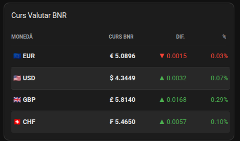
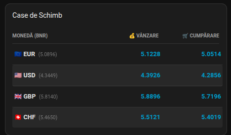
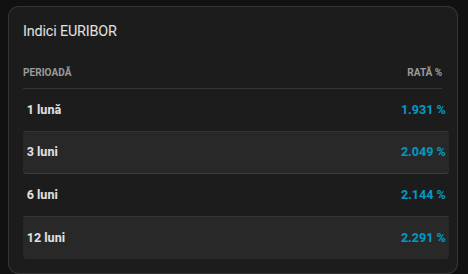

# 🏦 BNR & Exchange Custom Card for Home Assistant

Un card personalizat pentru Home Assistant, care afișează cursul valutar oficial BNR, cursurile caselor de schimb (Vânzare/Cumpărare) și indicii EURIBOR într-un format compact și elegant.

## 📋 Cerințe Prealabile

Pentru ca acest card să poată afișa date, trebuie să aveți instalată și configurată integrarea:
👉 **[Curs Valutar BNR prin cnecrea](https://github.com/cnecrea/cursbnr)**
## 🌟 Caracteristici
- Afișează cursurile oficiale BNR pentru diverse valute.
- Include cursurile de cumpărare și vânzare ale caselor de schimb.
- Prezintă indicii EURIBOR actualizați.

## 🚀 Instalare
1. Adaugă acest repository în HACS ca **Custom Repository**.
2. Navighează la HACS > ... > Custom Repositories. Adaugă URL-ul repository-ului (https://github.com/clmun/bnr-exchange-card) și selectează tipul `Dashboard`.
3. Caută `bnr-exchange-card` în HACS și instalează-l.

## ⚙️ Configurare

Cardul are mai multe moduri de afisare.

### _MOD Curs Valutar BNR_

Acest mod afișează cursurile oficiale BNR pentru valutele selectate.

**Exemplu card:**



Configurație YAML:
```yaml
type: custom:bnr-exchange-card
card_type: bnr
title: Curs Valutar BNR
entities:
  - sensor.curs_valutar_ron_eur
  - sensor.curs_valutar_ron_usd
  - sensor.curs_valutar_ron_gbp
  - sensor.curs_valutar_ron_chf
```


### _MOD Case de Schimb_

Acest mod afișează cursurile de cumpărare și vânzare ale caselor de schimb pentru valutele selectate.

**Exemplu card:**



Configurație YAML:
```yaml
type: custom:bnr-exchange-card
card_type: exchange
title: Case de Schimb
entities:
  - sensor.schimb_valutar_ron_eur
  - sensor.schimb_valutar_ron_usd
  - sensor.schimb_valutar_ron_gbp
  - sensor.schimb_valutar_ron_chf
```

### _MOD Indici EURIBOR_

Acest mod afișează indicii EURIBOR pentru diferite perioade.

**Exemplu card:**



Configurație YAML:
```yaml
type: custom:bnr-exchange-card
card_type: euribor
title: Indici EURIBOR
entities:
  - sensor.dobanda_euribor
```

## 🤝 Contribuții
Contribuțiile sunt binevenite! Vă rugăm să deschideți un issue sau un pull request pentru sugestii, bug-uri sau îmbunătățiri.
## 🙏 Mulțumiri
Mulțumiri speciale lui [[cnecrea](https://github.com/cnecrea)] pentru integrarea cursului valutar BNR, care face posibilă funcționarea acestui card.

## ☕ Susține dezvoltatorul

Dacă ți-a plăcut acest card și vrei să sprijini munca depusă, **invită-mă la o cafea**! 🫶  

[](https://buymeacoffee.com/clmun01c)

Mulțumesc pentru sprijin și apreciez fiecare gest de susținere! 🤗